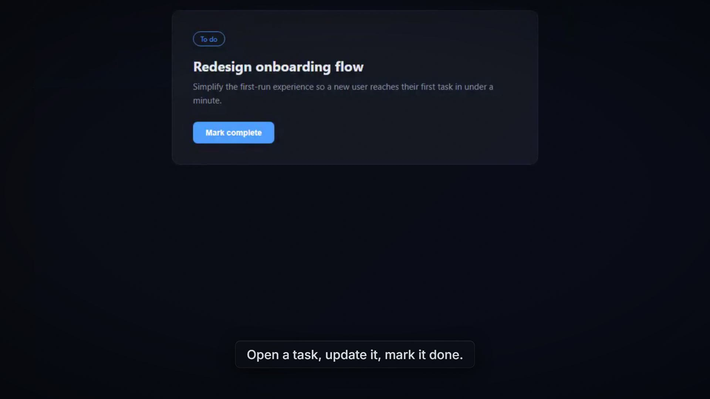

# openvidstudio

[](./LICENSE)


[](https://github.com/AnayDhawan/openvidstudio/stargazers)


openvidstudio is an open-source video-generation add-on, built on Remotion and
Playwright, that an AI coding agent drives through MCP tools to produce
launch and demo videos for a project directly from its repo and running app,
with an optional Higgsfield AI b-roll tier for shots that can't be captured
from a live screen. `packages/`, `templates/`, and `apps/` each get their own
README as they're built out.



*A frame from a real end-to-end sample video, not a mockup ([full clip](apps/site/public/brand/openvidstudio-sample-demo.mp4)). See it live on the [example gallery](apps/site/src/lib/gallery.ts) once the site is deployed.*

## Quick Start

Not published to npm yet - build and run locally from a clone:

```bash
git clone https://github.com/AnayDhawan/openvidstudio.git
cd openvidstudio
pnpm install
pnpm --filter @openvidstudio/mcp-server build
```

Then point your coding agent's MCP config at the built server:

```json
{
  "mcpServers": {
    "openvidstudio": {
      "command": "node",
      "args": ["/absolute/path/to/openvidstudio/packages/mcp-server/dist/stdio.js"]
    }
  }
}
```

See `packages/docs/PLANNING.md` for the guided intake flow and `packages/docs/OVERVIEW.md`
for the full pipeline shape.
