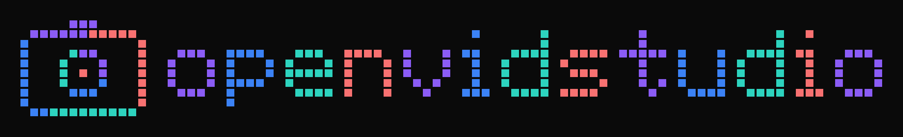
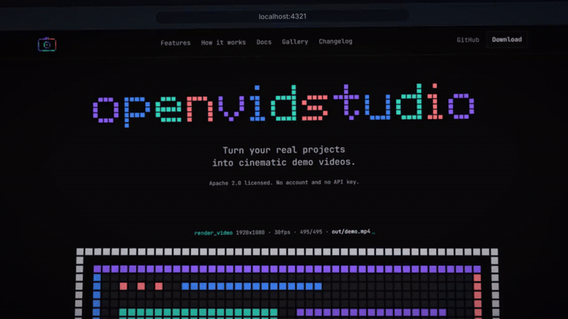

<div align="center">



# openvidstudio

**Your agent drives. Your product is the footage.**

An open-source demo-video pipeline built on Remotion and Playwright, driven end to
end by an AI coding agent through MCP. A real browser drives your real product and
every frame is a capture of it, not a generated mockup.

[Features](#openvidstudio-features) · [Quick start](#quick-start) · [Docs](#docs) · [Contributing](CONTRIBUTING.md)

[](https://github.com/AnayDhawan/openvidstudio/actions/workflows/ci.yml)
[](./LICENSE)

[](https://github.com/AnayDhawan/openvidstudio/stargazers)


</div>

---

<p align="center">
  
</p>

## Why openvidstudio?

Making a demo video normally means a timeline editor, manual keyframing, stock
b-roll standing in for your actual product, and hours of your own time. openvidstudio
puts the whole pipeline behind the agent you already use, and every frame it produces
is your app, captured live.

- **Real product, real pixels** - every screenshot and recording comes from your
  actually running app; the UI, the product text, and the layout are all ground truth.
- **Your agent drives** - no separate app, no timeline editor, no manual keyframing.
  Claude Code, Cursor, ChatGPT, or anything that speaks MCP runs the whole pipeline
  through twenty-nine tools, thirty with the Higgsfield tier enabled.
- **A directed video, not a screen recording** - push-ins, drift, shallow depth of
  field, an oversized cursor, narration, and a synthesized music bed turn plain
  captures into something you'd ship.
- **License-clean music, start to finish** - the built-in `pulse-bed.mp3` is
  generated at a fixed 112bpm so its cue grid is exact, and `find_music_bed` searches
  two CC0 public-domain catalogs (about 9,400 tracks) when you want a real track.
  No attribution line, no content ID claim, nothing to clear.
- **Not only web apps** - a desktop window, an Android device or iOS Simulator, and a
  terminal session are all capturable, so a CLI tool or a Linux distro gets real
  footage instead of a hand-drawn panel standing in for it.
- **One edit costs one beat** - beats render to their own cached segments and join
  under a stream copy, so fixing a caption in a five minute video re-renders ninety
  frames, not nine thousand.
- **The same beats, other outputs** - a README GIF, a docs screenshot set, store
  frames at each store's exact dimensions, and a manifest-driven 9:16 cut all come out
  of the finished render.

## openvidstudio features

| Area | What it does | Key tools |
| --- | --- | --- |
| **Project setup** | Scaffolds the project shell and checks the machine before anything runs | `init_project` · `preflight` |
| **Beats** | Plans, validates, and commits the narration-and-shot skeleton the whole render is built from | `plan_beats` · `validate_beats` · `write_beats_file` |
| **Capture** | Zoom-compensated browser, desktop, mobile, and terminal capture of the real running app | `capture_screenshot` · `capture_screen_recording` · `capture_desktop` · `capture_mobile` · `capture_terminal` |
| **Shot planning** | Ranks what the video should show from the repo's own emphasis, with evidence per pick | `plan_shots` |
| **Scenes** | Renders real Remotion scenes from ten templates, using each beat's own copy | `scaffold_scene` · `validate_scenes` |
| **Narration** | One paced clip per beat, sized to fit without sounding stretched | `generate_narration` |
| **Music** | A rights-clean synthesized bed by default, or a real CC0 track matched to the mood you want | `plan_music_cues` · `find_music_bed` · `import_music_bed` |
| **Sound design** | Works out which effects the built-in pack already covers and where to source the rest | `plan_sound_effects` |
| **Render** | Sequences scenes and audio, then renders draft or full quality, incrementally | `stitch_composition` · `render_video` · `contact_sheet` |
| **QC & diffing** | Pulls frames back out, diffs against the last accepted render, and flags docs drift | `qc_extract_frames` · `diff_beats` · `visual_regression` · `docs_drift` · `release_diff` |
| **Export** | A README GIF, a docs screenshot set, store frames, or a 9:16 cut, all from the finished render | `export_rendition` · `reformat_vertical` |
| **Brand** | Reads your repo's palette, fonts, and logo so the video looks like your product | `extract_brand` |
| **B-roll (optional)** | Higgsfield AI atmosphere shots for what a screen genuinely can't produce, never product UI | `import_higgsfield_clip` |

### Beats

- The skeleton every render is built from: a narration word budget per beat, validated
  for schema and pacing before anything is written to disk
- `write_beats_file` only commits what you approved; nothing renders off an
  unapproved plan

### Capture

- `capture_screenshot` and `capture_screen_recording` are zoom compensated, so a
  desktop's per-origin Chrome zoom never desyncs the frame from the real viewport
- `capture_desktop` covers a native window, a region, or a whole screen through
  ffmpeg, with Wayland routed through pipewire
- `capture_mobile` drives an Android device or an iOS Simulator
- `capture_terminal` records a real command run as timed text rather than pixels,
  through a pty when one is available

### Scenes

- `scaffold_scene` picks from ten templates and fills them with that beat's own copy,
  so a first render is structurally correct
- `validate_scenes` catches what renders successfully but is wrong, chiefly content
  cropped outside the camera

### Music

- The built-in `pulse-bed.mp3` runs at a fixed 112bpm, so its cue grid is exact and
  carries no rights question
- `plan_music_cues` reads that grid, or estimates one for any track you bring, so a
  scene cut lands on the beat instead of an arbitrary second
- `find_music_bed` searches two CC0 public-domain catalogs, about 9,400 tracks, for a
  bed with the mood you want; `import_music_bed` downloads it and trims, fades, and
  loudness-matches it into place, with a provenance file

### Render

- Beats render to their own cached segments and join under a stream copy, so a
  one-caption fix re-renders one beat, not the whole video
- `render_video` runs draft or full quality, and incrementally, only re-rendering the
  beats whose inputs changed
- `contact_sheet` puts every beat in one image, in a fraction of a full render

### QC & diffing

- `qc_extract_frames` pulls frames back out for review
- `diff_beats` shows what changed between two manifests and what that costs to fix
- `visual_regression` compares this render against the last accepted one, per beat,
  with a PR comment
- `docs_drift` flags which clips no longer match the pages they document
- `release_diff` takes two refs and produces a before/after manifest for a
  what's-new clip

### Export

- `export_rendition` produces a README GIF, a docs screenshot set, store frames at
  each store's exact dimensions, or a poster frame baked in as the render's thumbnail
- `reformat_vertical` produces a 9:16 cut with the crop chosen per beat from the
  manifest

### The capture engine on its own

[`@openvidstudio/capture`](./packages/capture) is published separately: zoom
compensated browser capture, interaction replay, and the desktop, mobile, and
terminal backends, with no dependency on Remotion, React, or the video pipeline. If
you want trustworthy captures of your app and you are not making a video, take that
package and ignore the rest.

## Quick start

```json
{
  "mcpServers": {
    "openvidstudio": {
      "command": "npx",
      "args": ["-y", "@openvidstudio/mcp-server"]
    }
  }
}
```

Drop that into your MCP client's config, which for Claude Code is `.mcp.json`, and
restart the client. Twenty-nine tools should appear.

Then paste this to your agent, from inside the repo you want a video of:

```
make a demo video of this project with openvidstudio.

handle it end to end. work out what this project is and how to start it, get it
running, and use its own brand rather than your defaults. ask me anything you
need along the way, one question at a time, and show me the result when it is
done.
```

That is the whole thing. You do not have to know the port, read the tool list, or put
the steps in order: the agent works out how to start the app from your scripts,
checks the machine with `preflight`, reads your palette and fonts with
`extract_brand`, asks what the video should cover, and shows you the full plan before
writing anything to disk. Say yes and it captures, renders, and hands you the mp4.

Working from a clone instead:

```bash
git clone https://github.com/AnayDhawan/openvidstudio.git
cd openvidstudio && pnpm install
pnpm --filter @openvidstudio/mcp-server build
# then point the config at packages/mcp-server/dist/stdio.js with "command": "node"
```

### Prerequisites

| What | Minimum | Needed for | Blocking |
| --- | --- | --- | --- |
| Node.js | 18 | Runs the server. `npx` ships with it, and `npx` is the install | yes |
| ffmpeg | 4.0 | Sound effects and pulling QC frames back out of a render | yes |
| Playwright | 1.48 | Resolvable inside the project the video is built in | yes |
| Chromium | whatever `playwright install` pulls | The browser capture actually drives | yes |
| Your app | running, reachable | Capture points at a real URL. Nothing serving means nothing to film | yes |
| edge-tts | any current, Python 3.8+ | Narration | no |

`preflight` checks every row and names the fix for your platform. Only the Node
version is enforced numerically; the rest are presence checks.

```bash
# Windows. Reopen the terminal after installing ffmpeg, winget only puts it on
# PATH for new shells.
winget install --id Gyan.FFmpeg -e
npm install playwright && npx playwright install chromium
pip install edge-tts

# macOS
brew install ffmpeg
npm install playwright && npx playwright install chromium
pip install edge-tts

# Debian or Ubuntu
sudo apt update && sudo apt install -y ffmpeg
npm install playwright && npx playwright install chromium
pip install edge-tts
```

pnpm is not needed to use openvidstudio. It is only for building this repo from a
clone, which is covered under Quick start.

### Scripts

| Command | Description |
| --- | --- |
| `pnpm build` | Build `@openvidstudio/capture` and `@openvidstudio/mcp-server` |
| `pnpm typecheck` | Run the TypeScript compiler across every workspace |
| `pnpm test` | Run the mcp-server test suite |

### Continuous integration

GitHub Actions runs `ci.yml` on every push and pull request, plus `labeler.yml` and
`stale.yml` for repo upkeep.

## Docs

Read `packages/docs/PLANNING.md` first for the guided intake flow, then
`packages/docs/OVERVIEW.md` for the full pipeline shape. `PIPELINE.md`, `STYLE.md`,
`CAPTURE.md`, and `SCRIPT.md` cover the individual steps and the rules that are
enforced rather than suggested. `API.md`, `NARRATION.md`, `PRESETS.md`, and
`HIGGSFIELD.md` cover the rest.

## Agent skills

Both this repo and every scaffolded project ship the official Remotion agent-skills
bundle (markup, captions, rendering, SaaS, maps, and more) for Claude Code, Cursor,
Windsurf, OpenCode, and GitHub Copilot, so whichever coding agent writes your scenes
has real Remotion knowledge to work from, not just this project's own
`PIPELINE.md`/`STYLE.md` rules.

## Tech stack

| Area | Choice |
| --- | --- |
| Video engine | [Remotion](https://www.remotion.dev) |
| Capture | [Playwright](https://playwright.dev), ffmpeg |
| Agent interface | [Model Context Protocol](https://modelcontextprotocol.io) (`@openvidstudio/mcp-server`) |
| Narration | edge-tts |
| Language | TypeScript |
| Package manager | pnpm workspaces |
| CI | GitHub Actions |

## Folder structure

```
openvidstudio/
├── packages/
│   ├── capture/        # @openvidstudio/capture: browser, desktop, mobile, terminal capture, no Remotion dependency
│   ├── core/            # Remotion compositions, scene templates, render pipeline
│   ├── mcp-server/       # @openvidstudio/mcp-server: the 31-32 MCP tools an agent calls
│   └── docs/             # PLANNING · OVERVIEW · PIPELINE · STYLE · CAPTURE · SCRIPT · API · NARRATION · PRESETS · HIGGSFIELD
├── templates/
│   └── default/           # Starter project scaffolded by init_project
├── brand/                  # Logo, wordmark, demo gif
└── .github/workflows/       # ci.yml, labeler.yml, stale.yml
```

## Status

The pipeline runs end to end and `scaffold_scene` emits scenes that render, so an
agent can go from a brief to a narrated mp4 without hand writing Remotion. The
templates are structurally correct but plain: a first render looks right rather than
good, and making it look good is still your job.

## Contributing

Contributions of all sizes are welcome - bug reports, docs, new scene templates, or a
whole new capture backend. Start with [CONTRIBUTING.md](CONTRIBUTING.md), and please
follow our [Code of Conduct](CODE_OF_CONDUCT.md). Security issues: see
[SECURITY.md](SECURITY.md).

## License

[Apache-2.0](./LICENSE)
