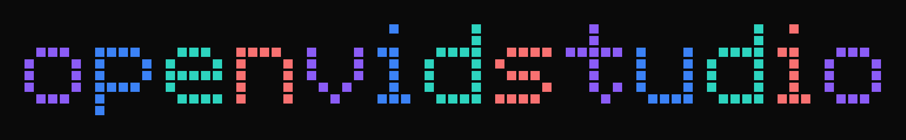

[](./LICENSE)

[](https://github.com/AnayDhawan/openvidstudio/stargazers)


openvidstudio is an open-source video-generation add-on, built on Remotion and
Playwright, that an AI coding agent drives through MCP tools to produce
launch and demo videos for a project directly from its repo and running app,
with an optional Higgsfield AI b-roll tier for shots that can't be captured
from a live screen. `packages/` and `templates/` each get their own README as
they're built out. The public site lives in a separate repo:
[vidstudio-site](https://github.com/AnayDhawan/vidstudio-site).


*A frame from a real render, not a mockup. Every screen in it was captured from a
running app by this pipeline's own capture tools.*

## Quick Start

```json
{
  "mcpServers": {
    "openvidstudio": {
      "command": "npx",
      "args": ["-y", "@openvidstudio/mcp-server"]
    }
  }
}
```

Drop that into your MCP client's config, which for Claude Code is `.mcp.json`, and
restart the client. Sixteen tools should appear.

Then start the app you want to film and paste this to your agent. You do not need to
read the rest of this README first; the prompt tells the agent what order to work in.

```
build a demo video of my app with openvidstudio.

my app runs at http://localhost:3000. change that if the port is different.

work in this order:
1. run preflight and fix anything it reports before going further
2. run extract_brand against this repo so the video uses my own colours,
   fonts and logo instead of openvidstudio's defaults
3. ask me what the video should cover and how long it should be
4. use plan_beats so the narration is written to fit the beats
5. show me the full beats file and wait for my yes before writing anything
6. capture, scaffold the scenes, then run validate_scenes
7. generate narration, stitch, and show me a contact_sheet before rendering
8. render a draft first, then full quality once I approve it

for sound, use the synthesized pack that ships with the project. only bring in
outside audio if I ask, and tell me if anything would need attribution.

write the narration like a developer talking to another developer. short
sentences, contractions, plain words, no marketing copy.
```

The agent checks the machine with `preflight`, reads your brand with `extract_brand`,
runs a guided intake, drafts a `beats.json`, and shows you the whole draft before
writing anything to disk.

Working from a clone instead:

```bash
git clone https://github.com/AnayDhawan/openvidstudio.git
cd openvidstudio && pnpm install
pnpm --filter @openvidstudio/mcp-server build
# then point the config at packages/mcp-server/dist/stdio.js with "command": "node"
```

## Prerequisites

| What | Minimum | Needed for | Blocking |
|---|---|---|---|
| Node.js | 18 | Runs the server. `npx` ships with it, and `npx` is the install | yes |
| ffmpeg | 4.0 | Sound effects and pulling QC frames back out of a render | yes |
| Playwright | 1.48 | Resolvable inside the project the video is built in | yes |
| Chromium | whatever `playwright install` pulls | The browser capture actually drives | yes |
| Your app | running, reachable | Capture points at a real URL. Nothing serving means nothing to film | yes |
| edge-tts | any current, Python 3.8+ | Narration | no |

`preflight` checks every row and names the fix for your platform. Only the Node
version is enforced numerically; the rest are presence checks.

```bash
# Windows. Reopen the terminal after installing ffmpeg, winget only puts it on
# PATH for new shells.
winget install --id Gyan.FFmpeg -e
npm install playwright && npx playwright install chromium
pip install edge-tts

# macOS
brew install ffmpeg
npm install playwright && npx playwright install chromium
pip install edge-tts

# Debian or Ubuntu
sudo apt update && sudo apt install -y ffmpeg
npm install playwright && npx playwright install chromium
pip install edge-tts
```

pnpm is not needed to use openvidstudio. It is only for building this repo from a
clone, which is covered under Quick Start.

## Docs

Read `packages/docs/PLANNING.md` first for the guided intake flow, then
`packages/docs/OVERVIEW.md` for the full pipeline shape. `PIPELINE.md`,
`STYLE.md`, `CAPTURE.md` and `SCRIPT.md` cover the individual steps and the rules
that are enforced rather than suggested.

## What the tools do

| Tool | |
|---|---|
| `preflight` | Checks node, ffmpeg, Playwright, Chromium, and whether your app is responding. Every failure names its fix |
| `plan_beats` | A beat skeleton with a narration word budget per beat |
| `validate_beats` | Schema and pacing, before anything is written |
| `write_beats_file` | Commits the approved beats |
| `capture_screenshot` | Zoom compensated capture of the real running app |
| `capture_screen_recording` | Full viewport recording |
| `scaffold_scene` | A scene that renders, from one of ten templates, using that beat's own copy |
| `validate_scenes` | Catches what renders successfully and is wrong, chiefly content cropped outside the camera |
| `generate_narration` | One clip per beat, paced to fit without sounding stretched |
| `stitch_composition` | Sequences scenes and audio |
| `contact_sheet` | Every beat in one image, in a fraction of a render |
| `render_video` | Draft or full quality |
| `qc_extract_frames` | Frames back out for review |
| `plan_sound_effects` | Works out which sounds the synthesized pack already covers, and where to get the rest |
| `extract_brand` | Reads your repo's palette, fonts and logo so the video looks like your product |
| `import_higgsfield_clip` | Optional AI b roll, gated on config |

## Status

The pipeline runs end to end and `scaffold_scene` emits scenes that render, so an
agent can go from a brief to a narrated mp4 without hand writing Remotion. The
templates are structurally correct but plain: a first render looks right rather than
good, and making it look good is still your job.
